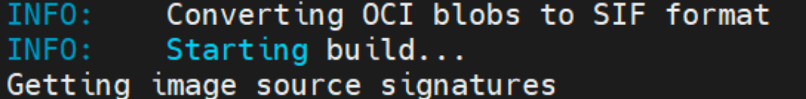
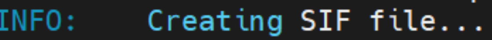

# CIKM23

This repo is for the code implementation of our submitted paper.

The readme file is organized as follows,

1. The model file
2. The modified data loader
3. The processed adjacency matrices and mapping matrices for datasets
4. The environment image preparation


# 1. Model

Our model is under the path of

It is parallel with other models for 'traffic-state-prediction', you can simply switch the model name to have a try on other baselines.

# 2. Dataloader

We reconstruct the data loader to make the mapping matrices available in the model.

With the processed adjacency matrices and mapping matrices in the folder of raw data, data loader can directly load them.

# 3. Dataset

Please download the processed datasets from

Put them under the folder without changing the processed adjacency matrices and mapping matrices

# 4. Running environment

We implement the customized environment with **singularity** image for better execution on HPC.If you are using Docker, the key idea should be similar with our implementation.

The singularity official documentation will provide the quick start-up with installation steps.

*All of the following scripts are executed on the **root path** of this project!*

## 4.1 Base image

As we refer to the implementation of the lib-city, we follow their basic pytorch major version of 1.7.1 with cuda11.0.

A good practice is to use a dev version of the PyTorch base image from the official docker registry

```sh
# https://hub.docker.com/layers/pytorch/pytorch/1.7.1-cuda11.0-cudnn8-devel/images/sha256-f0d0c1b5d4e170b4d2548d64026755421f8c0df185af2c4679085a7edc34d150?context=explore
singularity pull docker://pytorch/pytorch:1.7.1-cuda11.0-cudnn8-devel
```

If everything goes well, you will see the following INFO when pulling the base image



Once the downloading is done, you will get a **SIF image** with the suffix **.sif(like pytorch_1.7.1-cuda11.0-cudnn8-devel.sif)** on your local machine. This will be used as a base image in the following steps.

## 4.2 Install Requirements

1. Create a definition file(named NAME.def) as follows,

```sh
#Bootstrap is used to specify the agent,where the base image from,here localiage
means to build from a local image
Bootstrap: localimage
## This is something like 'From' in DOCKERFILE
From: ./pytorch_1.7.1-cuda11.0-cudnn8-devel.sif
# %files can be used to copy files from host into the image
# something like 'COPY' in DOCKERFILE
# here we copy the requirements.txt into the image, then we can use it to install the required dependencies
%files
    ./Bigscity-LibCity/requirements.txt /opt
# %post is used to build the new image
# Usage is same to shell.Here we used pip to install dependencies
%post
    pip install -r /opt/requirements.txt
    pip install protobuf==3.20.0
#% environment is used to set env_variables once the image starts
%environment
    export PATH=$PATH:/usr/local/cuda-11.0/bin
    export LD_LIBRARY_PATH=$LD_LIBRARY_PATH:/usr/local/cuda-11.0/lib64:/usr/lib/x86_64-linux-gnu
```

2. Now execute the following command to build the image

```sh
## still on the root path
singularity build CIKM23.sif NAME.def
```

You will see the following INFO when building the new image



If nothing is wrong after creating SIF file, then you will get the image file .sig on the root path.

## 4.3 Execution

Now the environment is ready, and all the code should be able to execute properly now.

Here are the slurm script and command for reference

```shell
# cd libs-city
# pwd
# this is the key command,remember to add the '--nv' option
singularity exec --nv ../NAME.sif python3 ./run_model.py --task traffic_state_pred
--model NAME --dataset METR_LA
```

```shell
#!/bin/bash
## if you are using SBATCH,pls remeber to add proper command

singularity exec --nv ../NAME.sif python3 ./run_model.py --task traffic_state_pred
--model NAME --dataset METR_LA
```

