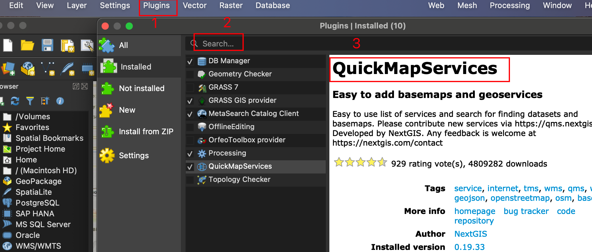

# CIKM23

This repo is for the code implementation of our submitted paper.

The readme file is organized as follows,

1. The model files
2. The processed adjacency matrices and mapping matrices for datasets.
3. The utils for solving BCC
4. The visualization code.
5. The environment image preparation.


# 1. Model

Our model is under the path of ./code/HIEST.py.
We also provide an implementation of a Traffic-Transformer under the [guide of the lib-city](https://bigscity-libcity-docs.readthedocs.io/en/latest/developer_guide/implemented_models.html) 

These two models are for 'traffic-state-prediction', you can add them into the pipeline under the [instructions]((https://bigscity-libcity-docs.readthedocs.io/en/latest/developer_guide/implemented_models.html) ) provided by lib-city.

# 2. Processed Data

For the attributes self.adj_mx and self.Mor, they will be initialized with the processed adjacency matrix and mapping matrix. Please check the path settings to make it correspond with the dataset.

For the training datasets, you can refer to the [datasets collection of lib-city](https://bigscity-libcity-docs.readthedocs.io/en/latest/get_started/quick_start.html)

# 3. The utils for solving BCC

The utils for solving BCC are under the path of ./utils .

For the usage, you can refer to the visualization code under the path of ./code/visualization.py

# 4. The visualization code

Our visualization result is implemented by the [QGIS](https://qgis.org/en/site/).

The visualization code is used to generate the Geo_JSON file to be imported into the QGIS.

We generate a .json file for each regional/global node.

Then you can import them as follows:


You can also search and install the QuickMap services to add the base map.



# 5. Running environment

The running environment aligns with the [requirements of lib-city](https://github.com/LibCity/Bigscity-LibCity/blob/master/requirements.txt)

We are glad to share the following guide for build environment to ease reproducibility.

We implement the customized environment with [singularity](https://docs.sylabs.io/guides/3.7/user-guide/index.html) image for better execution.

If you are using Docker, the key idea should be similar with our implementation.

The singularity official documentation will provide the quick start-up with installation steps.

*All of the following scripts are executed on the **root path** of lib-city!*

## 5.1 Base image

As we refer to the implementation of the lib-city, we follow their basic pytorch major version of 1.7.1 with cuda11.0.

A good practice is to use a dev version of the PyTorch base image from the official docker registry

```sh
# https://hub.docker.com/layers/pytorch/pytorch/1.7.1-cuda11.0-cudnn8-devel/images/sha256-f0d0c1b5d4e170b4d2548d64026755421f8c0df185af2c4679085a7edc34d150?context=explore
singularity pull docker://pytorch/pytorch:1.7.1-cuda11.0-cudnn8-devel
```

If everything goes well, you will see the following INFO when pulling the base image


Once the downloading is done, you will get a **SIF image** with the suffix **.sif(like pytorch_1.7.1-cuda11.0-cudnn8-devel.sif)** on your local machine. This will be used as a base image in the following steps.

## 5.2 Install Requirements

1. Create a definition file(named HIEST.def) as follows,

```sh
#Bootstrap is used to specify the agent,where the base image from,here localimage means to build from a local image
Bootstrap: localimage
## This is something like 'From' in DOCKERFILE to indicate the base image
From: ./pytorch_1.7.1-cuda11.0-cudnn8-devel.sif

# %files can be used to copy files from host into the image
# like 'COPY' in DOCKERFILE
# Here we copy the requirements.txt into the image, then we can use it to install the required dependencies.
%files
    ./Bigscity-LibCity/requirements.txt /opt

# %post is used to build the new image
# Usage is same to shell.Here we used pip to install dependencies.
%post
    pip install -r /opt/requirements.txt
    pip install protobuf==3.20.0 #to solve some warning we met
 
#% environment is used to set env_variables once the image starts
# These lines are necessary to load cuda
%environment
    export PATH=$PATH:/usr/local/cuda-11.0/bin
    export LD_LIBRARY_PATH=$LD_LIBRARY_PATH:/usr/local/cuda-11.0/lib64:/usr/lib/x86_64-linux-gnu
```

2. Now execute the following command to build the image

```sh
## still on the root path
singularity build HIEST.sif HIEST.def
```

You will see the following INFO when building the new image


If nothing is wrong after creating SIF file, then you will get the image file **HIEST.sif** on the root path.

## 5.3 Execution

Now the environment is ready, and all the code should be able to execute properly now.

Here are the slurm script and command for reference

```shell
# cd libs-city
# pwd
# this is the key command,remember to add the '--nv' option
singularity exec --nv ../HIEST.sif python3 ./run_model.py --task traffic_state_pred
--model HIEST --dataset METR_LA
```

```shell
#!/bin/bash
## if you are using SBATCH,pls remeber to add proper command,such as
# SPARTION

singularity exec --nv ../HIEST.sif python3 ./run_model.py --task traffic_state_pred
--model HIEST --dataset METR_LA
```

